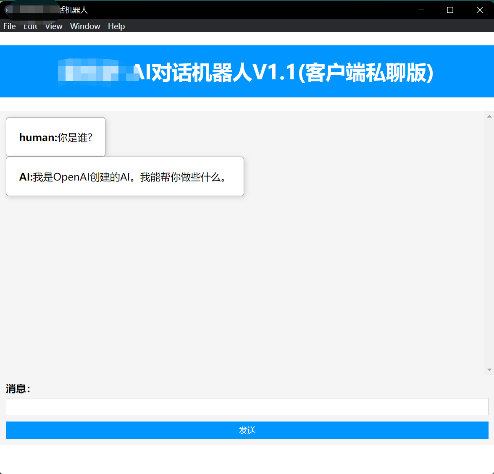
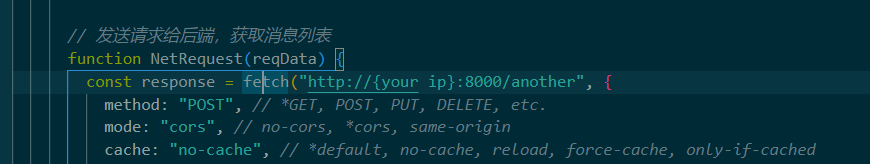

# Fuel - the client for propeller
This project is the client for [propeller](https://github.com/541573560/propeller),which a chat bot building by openai api.  
using `electron` to build this app  
# preview
   

# usage
## before you run
* you should have a [nodejs](https://nodejs.org/en/) environment
* running [propeller](https://github.com/541573560/propeller)
* change `index.html`, fill in you server ip

## run
```
npm install
npm start
```
## build
using below commend will generate a folder call `out` and access file in `./out/make/*/x64/openapi-client-1.1.0 Setup.exe`
```
npm run make
```
# license
MIT